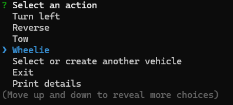

# Vehicle Builder
[](https://opensource.org/licenses/ISC)

## Description:
Command line application that allows the user to either create a new vehicle or select an existing vehicle. The user is able to perform certain actions with the selected vehicle until switching to another vehicle or exiting the application.  

Originally, only Cars were able to be created and used; however, Motorbike and Truck functionality has been added. This exercise built OOP skills, TypeScript skills, and the skill of working with existing code bases.

## Table of Contents:
- [Technologies](#technologies)
- [Installation](#installation)
- [Usage](#usage)
- [License](#license)
- [Questions](#questions)

## Technologies:
- TypeScript
- Node.js
- [Inquirer.js](https://www.npmjs.com/package/inquirer)

## Installation:
- Download or clone this repo.
- From its root directory, install the necessary packages with the following command:
```
$ npm i
```
## Usage:
- Watch this demo:  


https://github.com/user-attachments/assets/8ed56c58-f581-4d2e-ad01-5ded8803c318


[Demo video - google drive](https://drive.google.com/file/d/1aqW21ntLOz3ER1M1Lx-zOiFXdQ1unV-K/view?usp=sharing)

- From this repo's root directory, start the application by running the following command:
```
$ npm start
```
- Either create a new vehicle or select an existing vehicle.  

- If creating a new vehicle, follow the prompts to enter the vehicle's information.  

- Select from the list of actions to perform with the vehicle, unitl satisfied.  

- Switch to another existing vehicle.

- Select from the list of actions to perform with the vehicle, unitl satisfied.

- Note: 'Tow' functionality only works for Trucks. Running it on another type of vehicle results in this message - "This vehicle isn't a truck; therefore, it cannot tow."
- Note: 'Wheelie' functionality only works for Motorbikes. Running it on another type of vehicle results in this message - "This vehicle isn't a motorbike; therefore, it cannot do a wheelie."
- Exit the program. (This erases created vehicles, and the states of vehicles that will be re-created upon restart.)  


## License:
This application is covered under the [ISC](https://opensource.org/licenses/ISC) license.

## Questions:
Contact me via github: [kayla-e774](https://github.com/kayla-e774)  
Or email me at: <kengelstad16@gmail.com>
